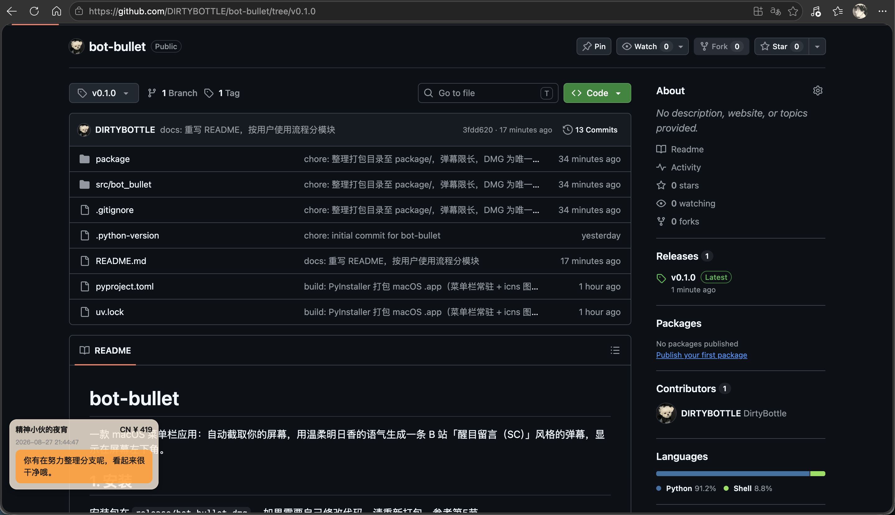

# bot-bullet

> 🤖 给你的屏幕装一个会吐槽的 AI 搭子

**bot-bullet** 让屏幕自己开口说话。它静静看你的桌面，每隔十几秒，用 DeepSeek 视觉模型读懂画面，然后用式波·明日香·兰格雷的口吻，在你屏幕上弹出一条 B 站「醒目留言（SC）」风格的高亮弹幕。

不是通知，不是提醒，是**你的电脑在实时刷弹幕**——写代码、看视频、打游戏，屏幕左下角都会蹦出一句恰到好处的吐槽或鼓励。

- 🧠 **真·AI 看懂屏幕**：DeepSeek 视觉模型实时理解画面内容，不是定时冒固定台词；
- 💭 **拟人弹幕**：式波·明日香·兰格雷的全面——毒舌与温柔并存，能吐槽也能鼓励，代码场景还会给一句专业建议；
- 🎯 **B 站 SC 风格**：价位配色、随机昵称、随机金额，像真弹幕一样鲜活；
- 🚀 **全自动**：菜单栏常驻，开始 / 暂停一键切换，填一次 API Key 就开工。

`录屏 → 视觉模型 → 弹幕上屏` 的流式反馈，让 AI 不再是对话框里的聊天机器人，而是**长在你屏幕上的数字搭子**。



## 1. 安装

安装包在 **GitHub Releases** 页面下载（`.dmg` 文件）。到 [Releases](https://github.com/DIRTYBOTTLE/bot-bullet/releases) 下载安装包后：双击打开，把 **bot-bullet** 拖入 Applications 文件夹，然后从启动台或 Spotlight 启动 bot-bullet。

首次启动如果 macOS 提示无法验证开发者：在弹窗里点「打开」即可。
首次截屏时系统会请求「屏幕录制」权限，**必须允许**，否则截屏全黑、弹幕无内容。

需要自己改代码重新打包的话，参考第 5 节。

## 2. 使用

1. 点击菜单栏的红底「弹」图标；
2. 点「设置 DeepSeek API Key…」，填入你的 [DeepSeek API Key](https://platform.deepseek.com/) 并保存；
3. 保存后自动开始运行，屏幕左下角约每 15 秒弹出一条弹幕，60 秒后自动消失。

## 3. 常见问题

**想彻底卸载？**
把 Applications 里的 bot-bullet 移到废纸篓即可；配置文件与 API Key 保存在 `~/.config/bot-bullet/config.json`，可一并删除。

## 4. 从源码运行（开发者）

```bash
uv sync
uv run bot-bullet-tray      # 菜单栏应用
uv run bot-bullet           # 无界面的命令行模式（调试用）
```

## 5. 打包

```bash
./package/build_mac.sh
```

脚本会依次完成图标生成、PyInstaller 打包、设置菜单栏常驻与版本号写入，最终产出唯一的安装文件 `release/bot-bullet-<版本号>.dmg`（版本号取自 `pyproject.toml`）。打包相关的一切脚本都在 `package/` 目录下。
